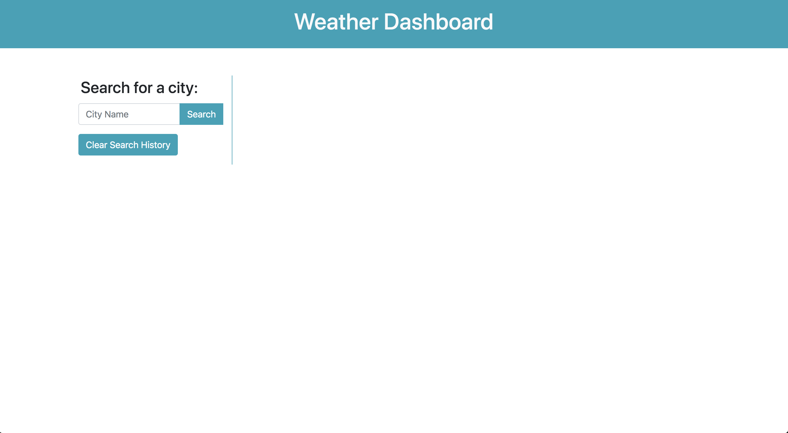
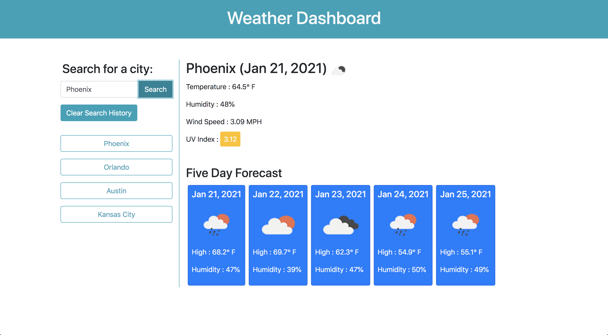
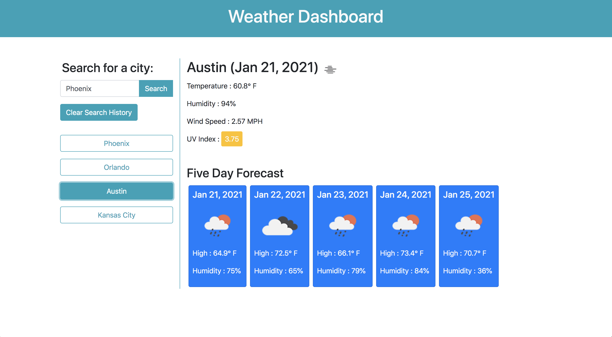
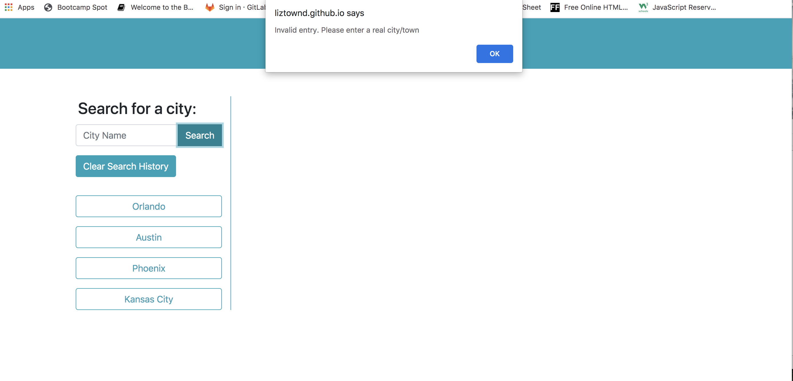
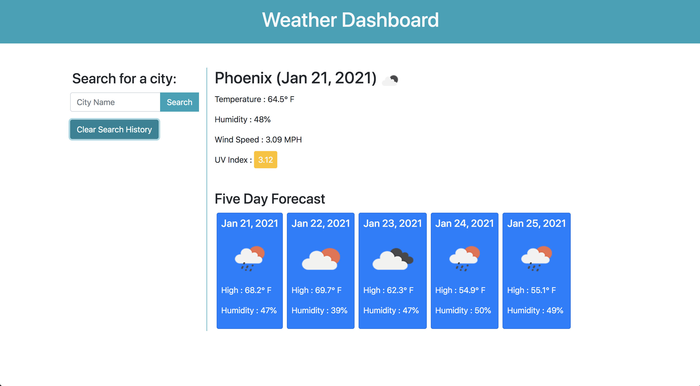

# Weather Dashboard

A weather dashboard utilizing API calls to the <a href="https://openweathermap.org/api">Open Weather API</a> to return data. Styled entirely with Bootstrap, there is no personal css. 

When loaded, the user is presented with an input box to search a city:

The results for current conditions and a five-day forecast are then displayed to the right: 

The searched city is added to an array which is used to generate a list of history buttons of recent searches, with the most recent at the top. If the searched city is already in the array, it is not added again. When clicked, the history button reloads the data with the appropriate city information:

If the city is not recognized or misspelled or the search is performed without entering a city name the user is alerted and the data is not stored to the array:

On reload, the page will display data for the most recent city searched using local storage.

The Clear History button removes data from local storage and clears the history buttons from the page:

# The Code

As mentioned above, all styling was accomplished with Bootstrap, with no personal css. The initial search input and clear history button are hard coded into the html but all other elements are created dynamically using jQuery and Javascript. 

There are three API calls to return data: The initial call to get current conditions utilizes the name of the city as the search query. Another call gets UV Index data, and a final call retrieves the future forecast. The UV Index call and future forecast both require a latitude and longitude to search the API, which is returned with the first call and stored in a global variable so the other calls can access it. 

The date of the current condition and the dates of the forecast are returned in a unix value which is converted to plain English using the Javascript Date method. 

# Deployment

The deployed application can be found at : <a href="https://liztownd.github.io/weather-app/">liztownd.github.io/weather-app/ </a>

